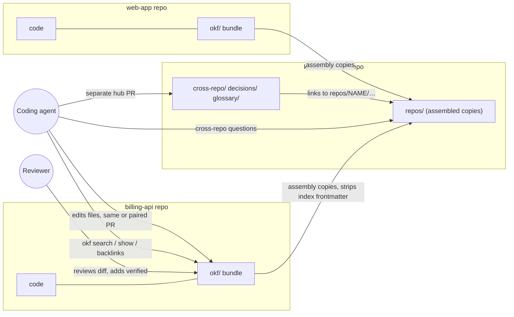
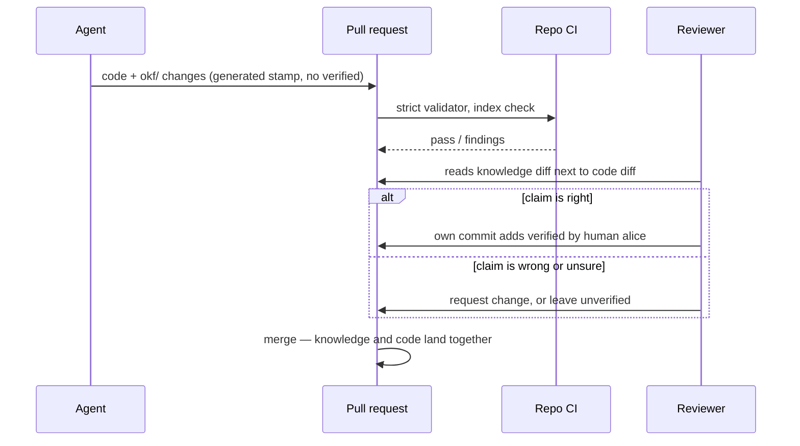
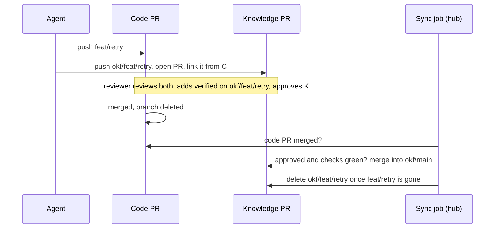
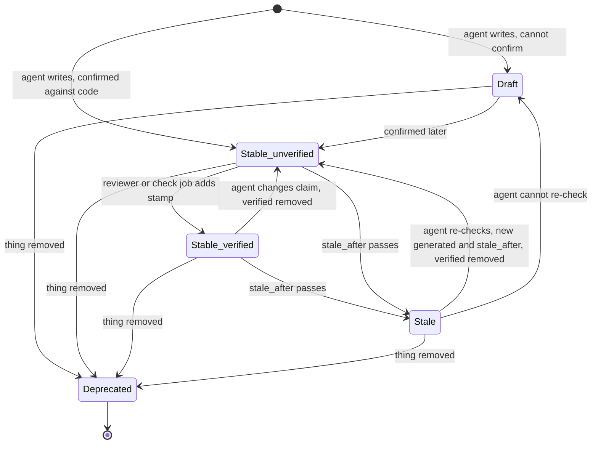

# How the OKF knowledge system works: interactions and UX

Date: 2026-09-29. Status: design. It builds on the
[research report](../research/okf-knowledge-system.md). Nothing is installed yet.

## Gist

The system adds no new app or server. People and agents use tools they already
have: markdown files in each repo, one CLI (`okf`), one agent skill, pull
request review, and CI. It runs as a loop:

1. **Read.** Before a task, the agent reads what the repo knows.
2. **Work and write.** The agent records what it learned next to the code. In
   folder mode that is the same pull request as the code. In branch mode, for
   maintainers who want no knowledge files on their code branches, it is a
   paired knowledge pull request (section 4.9).
3. **Review.** A human checks that knowledge in the normal diff, or in the
   linked knowledge pull request in branch mode, and can mark it verified.
4. **Assemble.** One script copies every repo's knowledge into a hub view, so
   cross-repo questions can be answered. Agents run it before a cross-repo
   question; hub CI runs it nightly to catch broken cross-repo links.

The main UX risks:

- Search results do not show trust or staleness, so the agent needs a second call.
- The hub view is only as fresh as its last assembly, and each assembly
  fetches every repo.
- Nothing stops an agent from writing a fake "human verified" stamp. Only review catches it.
- Branch mode depends on two local git hooks and a sync job in the hub. An
  agent without the hooks must pair `okf/` with its branch itself, and if the
  sync job stops, knowledge pull requests stay open after their code merges.
  `git pull` does not update `okf/`, so the agent pulls it before reading.
- Until okfcli#34 is fixed, `okf validate` rejects the datetime `stale_after`
  this design uses, and `okf show` says `stale: false` for such a concept even
  after the date passes. A date-only value avoids both today but departs from
  the spec (section 4.6).

Command output in this document is real. It comes from okfcli v0.5.0, run on
the test data in the `okf-tools` repo: `testdata/fixture/`, rebuilt from the
research protocol's planted facts, and, for hub queries, `testdata/proto/`, the
same data with the report's conventions, assembled into a hub. `okf-tools`
checks both sets with `test/check-fixture.sh`. Branch-mode output comes from
scratch repos ([evidence](../research/okf-knowledge-system/evidence/branch-mode.md)). The
skill, the fetching assembly script, the hub CI job, the sync job and the
check job are proposals. The branch-mode setup script is a sketch. Section 9
lists what does not exist yet.

## 1. The original problem

The research set out to give coding agents a knowledge system that works
across 10–50+ repos. The research contract was only partly retrievable, so
this list is rebuilt from the report and its test protocol. It has five needs:

| # | Need | What goes wrong today |
|---|---|---|
| N1 | Agents start each task knowing why the code is the way it is | Every session starts blank. The agent re-derives knowledge or repeats a known mistake, such as retrying an invoice call without an idempotency key. |
| N2 | Agents can update that knowledge as a normal part of their work | What agents learn stays in chat logs and is lost |
| N3 | Humans can check agent-written knowledge cheaply | Agent notes are either trusted blindly or ignored |
| N4 | Knowledge covers how repos depend on each other | A change in one repo breaks another, and no single repo records the link |
| N5 | Knowledge stays current and portable across agents and tools | Notes rot, and a tool-specific store locks the team in |

Section 7 maps each need to the part of the system that meets it.

## 2. Who and what is involved

People and machines:

| Actor | Role |
|---|---|
| Coding agent | Claude Code, Cursor or omp, working in one repo with the skill loaded |
| Developer | Works next to the agent and asks it questions |
| Reviewer | Reviews pull requests. Is the only one who adds `verified: human:<login>` stamps. |
| Repo CI | On every pull request, checks that the repo's bundle follows the format and that its index files are current. In branch mode this is a workflow stored on `okf/main` that runs on knowledge pull requests; GitHub runs it for pull requests into `okf/main` (tested on a scratch repo, 2026-10-06). |
| Hub CI | Assembles every repo each night, or when a repo pipeline asks for it, and fails on broken cross-repo links |
| Sync job | Branch mode only. Runs in the hub on a schedule. Once a code pull request merges, it merges the paired knowledge pull request if a human approved it and its checks pass. It deletes knowledge branches whose code branch is gone from the remote. |
| Check job | A CI job that runs a machine check, such as a contract test against the OpenAPI file. After merge it commits a fresh `verified: process:<job>` entry on each concept it covers. It is the only writer of `process:` stamps. In branch mode it runs from the hub and commits to `okf/main`. |

Each repo stores its bundle in one of two modes, chosen by its maintainers:

- **Folder mode:** `okf/` is a folder on the code branches.
- **Branch mode:** the bundle lives on its own branches of the same repo:
  `okf/main` pairs with the default branch and `okf/<b>` with code branch
  `<b>`. `okf/` is a local git worktree of the paired branch, hidden from the
  code branches (section 4.9).

In both modes the bundle is at `<repo>/okf/`, so every `okf` command below
works unchanged.

Artifacts:

| Artifact | Where | Written by |
|---|---|---|
| Repo bundle | `<repo>/okf/`: one markdown file per concept | Agents and developers, in code pull requests (folder mode) or paired knowledge pull requests (branch mode) |
| Hub repo | `knowledge-hub/`: cross-repo dependencies, shared decisions, glossary | Agents and developers, in hub pull requests |
| Assembled hub view | `knowledge-hub/repos/<name>/`: copies of every repo bundle, ignored by git | Assembly script only, run locally or in hub CI |
| Skill | One `SKILL.md` that every agent loads | The platform team |
| Branch-mode setup | [okf-branch-setup.sh](../research/okf-knowledge-system/evidence/okf-branch-setup.sh): creates the `okf/` worktree and installs two hooks in `.git/hooks/`, which git never commits | The platform team; each developer runs it once per clone |



## 3. What each actor touches

| Actor | Uses | Never does |
|---|---|---|
| Coding agent | Six commands: `okf search`, `show`, `list`, `backlinks`, `index`, `validate` (the okf-skills validator stands in for `validate` until okfcli#34 is fixed). Plain file edits. In branch mode, `git -C okf` to check the paired branch, pull, commit, and push. | Adds a `verified` stamp, `human:` or `process:`; edits `knowledge-hub/repos/`; links from one repo bundle into another repo's files; pushes to `okf/main` directly |
| Developer | Reads the markdown on GitHub or in an editor. Asks the agent. Runs the assembly script locally for cross-repo work. In branch-mode repos, runs the setup script once per clone. | Needs to learn the CLI to benefit |
| Reviewer | The pull request diff, usually 1–3 knowledge files; in branch mode, the knowledge pull request linked from the code one. Adds one `verified` line in their own commit. | Approves a `verified: human:` line they did not write |
| Repo CI | `okf_validate.py okf --strict` from okf-skills; then `okf index okf` and `test -z "$(git status --porcelain -- okf)"`, which fails if the committed index files are out of date. The branch-mode workflow runs the same checks on `.`, the bundle root. | Changes any files |
| Hub CI | Assembly script, strict validator, broken-link report | Writes back into repos |
| Sync job | The GitHub API for pull request states; merges approved knowledge pull requests with a merge commit; comments when one is missing, unapproved or failing; deletes `okf/<b>` branches | Merges a knowledge pull request before its code pull request merges, or without a human approval; opens knowledge pull requests itself; touches code branches or deletes `okf/main` |
| Check job | Its machine check; one `verified` line per covered concept, in its own commit after merge | Stamps a concept its check does not cover |

**The UX choice: the interface is the file.** Tools that rewrite frontmatter
made noisy diffs; one tag change became a 17-line diff (report, finding 6).
Plain file edits kept every change to 1–3 files. So reviewers read knowledge
changes the way they read code.

## 4. Journeys

### 4.1 An agent starts a task in one repo

The task: "Add retries to the invoice client in billing-api."

1. The skill applies because the repo has an `okf/` folder, or, in branch
   mode, because its remote has an `okf/main` branch. Agents load a skill
   only when its description matches the task, so each repo's `AGENTS.md`
   (or `CLAUDE.md`) also has one line pointing at `okf/index.md` and the
   skill (section 4.8). A branch-mode repo cannot carry that line on its code
   branches, so it goes in each developer's user-level agent instructions
   instead (section 4.9). [INFERENCE: skill auto-loading was not tested.]
2. The agent reads `okf/index.md`, then `okf/overview.md`. The test data has no
   `overview.md`; section 4.8 adds one to every repo.
3. It searches for the task's key words:

   ```
   $ okf search okf --text idempotency
   "count": 3,
   "results": [
     {"id": "contracts/invoice-api",   "title": "Invoice API v2", "type": "API Contract"},
     {"id": "gotchas/idempotency-key", "title": "Invoice creation needs an idempotency key", "type": "Gotcha"},
     {"id": "services/billing-api",    "title": "Billing API", "type": "Service"}]
   ```

4. Search hits show only the id, title and type. One `okf list okf` call adds
   `status` and `trust_tier` for every concept in the bundle, but not
   staleness. So the agent opens each hit it will rely on:

   ```
   $ okf show okf gotchas/idempotency-key
   "description": "POST /v2/invoices double-charges on retry without Idempotency-Key.",
   "generated":   {"at": "2026-06-01T12:00:00Z", "by": "cursor/gpt-5.6"},
   "stale_after": "2026-09-01T00:00:00Z",
   "stale": false,            <- wrong: the date has passed (okfcli#34)
   "status": "draft",
   "trust_tier": "unverified"
   ```

5. The concept is a draft, unverified and past its `stale_after` date.
   `okf show` still says `stale: false` because of okfcli#34. Until that is
   fixed, the skill tells the agent to compare `stale_after` with today's date
   itself. The agent treats the concept as a lead to check, not a fact
   (section 6). It reads the handler code and confirms that retries without
   the key double-charge.
6. The agent writes the retry code, and it sends the key.

This single read could prevent a double-charge bug. The agent still checked
the claim, because the concept's trust level told it to.

### 4.2 The agent records what it learned

The agent updates the knowledge next to the code: on the same branch in
folder mode, or on the paired knowledge branch `okf/<b>` in branch mode. The
steps are the same in both; section 4.9 adds the branch-mode commit and push.

1. It edits `okf/gotchas/idempotency-key.md`. It sets `status: stable`, adds
   `sources` pointing at the handler, and adds a new `generated` stamp and a
   new `stale_after`. If the concept had `verified` entries, it removes them,
   because a stamp covers only the text that was checked (section 5):

   ```yaml
   status: stable
   generated: { by: claude-code/opus-5, at: 2026-09-29T14:00:00Z }
   stale_after: 2027-03-28T14:00:00Z
   sources:
     - id: create-invoice
       resource: https://github.com/acme/billing-api/blob/main/internal/invoice/create.go
   ```

2. It changes the root-relative link `/contracts/invoice-api.md` to
   `../contracts/invoice-api.md`. Links starting with `/` break inside the hub
   (section 4.4).
3. If it learned something new, for example a retry budget, it writes a new
   file, `okf/gotchas/retry-budget.md`, with one concept in it.
4. It runs `okf index okf` and the okf-skills validator
   (`okf_validate.py okf --strict`), the same checks repo CI runs. That
   validator passes on the edit above. `okf validate okf` rejects it
   ("'stale_after' must be an absolute YYYY-MM-DD date"), so the agent uses it
   only after okfcli#34 is fixed. Once the repo's index files exist (section
   4.8), the research test of this path produced a 1–3 file diff (okfcli
   evidence, test T7).
5. It does not add `verified`. The pull request description lists the
   knowledge files it changed, so the reviewer can find them. In branch mode
   the code pull request links the knowledge pull request instead.

The index files are generated, so two pull requests often conflict in them.
In a test, conflicts appeared when both added concepts that sort next to each
other, when both created a folder, and when both edited concepts with adjacent
index rows. When a merge or rebase conflicts in an `index.md`, the agent takes
either side and re-runs `okf index okf`; that gave a correct index every time
([evidence](../research/okf-knowledge-system/evidence/index-files.md)).
In `log.md` it keeps both entries. Neither validator notices an out-of-date
index, so repo CI checks it (section 3).

What the agent must not record: facts the code already states plainly, copied
code, or secrets. Knowledge explains why, how things connect, and what
surprises people.

### 4.3 The reviewer checks and verifies

In folder mode:



- The reviewer reads the knowledge change in the same diff as the code it
  describes. They do not need a second tool.
- Verifying adds one line. In the research test it produced a one-line diff,
  and the regenerated index files did not change.
- After merge, `okf list` and `okf show` report `trust_tier: human-reviewed`.
  Future agents treat the concept as reliable.
- A reviewer may merge the code and leave the knowledge unverified. Unverified
  knowledge is still useful. Agents just check it first.
- The proof of who added a `human:` stamp is the pull request, not the commit.
  A squash merge folds the reviewer's commit into one commit authored by the
  pull request author. So a later check should match the stamp's login
  against the reviewers who approved that pull request, not against commit
  authors.

In branch mode the knowledge arrives in its own pull request, from `okf/<b>`
into `okf/main`, linked from the code pull request. The reviewer reads both,
adds any `verified` line on `okf/<b>`, and approves the knowledge pull request.
Nobody merges it before the code. Once the code pull request merges, the sync
job merges the knowledge pull request, but only if a human approved it and
its checks pass (section 4.9). Unlike folder mode, knowledge nobody reviewed
does not ride along with the code; it waits. The knowledge pull request is the
proof of who added a `human:` stamp.

### 4.4 An agent answers a cross-repo question

The task, in billing-api: "Change the response shape of POST /v2/invoices."
The agent first asks who depends on that contract.

1. A single repo cannot answer this, so the agent uses the assembled hub. The
   developer has `knowledge-hub` checked out, and the agent refreshes its view:

   ```
   $ assemble-hub.sh ~/src/knowledge-hub
   ```

   The script reads `repos.txt` and fetches only the bundle of each listed
   repo from its git remote: the `okf/` folder of the default branch in folder
   mode, or the `okf/main` branch in branch mode. It copies each one into
   `repos/<name>/` and removes frontmatter from the copied `index.md` files.
   Hub CI runs the same script. The developer needs read access to every
   listed repo, but no local checkout of any of them. Copying 50 repos took
   2.9 s in the research; fetching them was not measured. [INFERENCE: with
   shallow sparse clones kept between runs, a refresh is one `git fetch` per
   repo.]
2. It asks for backlinks, meaning every concept that links to this one:

   ```
   $ okf backlinks ~/src/knowledge-hub repos/billing-api/contracts/invoice-api
   "backlinks": [
     "cross-repo/invoice-dependency",
     "repos/billing-api/gotchas/idempotency-key",
     "repos/billing-api/services/billing-api"],
   "count": 3
   ```

3. Only `cross-repo/…` and `repos/<other repo>/…` entries are dependents. The
   other two are billing-api's own concepts. The one dependent here is
   `cross-repo/invoice-dependency`, a hub concept verified by `human:alice`.
   It says: "Breaking changes to the contract need a web-app release first."
4. The agent stops before the breaking change. It tells the developer that
   web-app must ship first, citing the concept. It can then offer an additive
   change instead.

At 10,000 concepts, search took 0.37 s and backlinks 0.34 s (medians). So the
agent can run these checks by default.

### 4.5 Recording a cross-repo fact

Say the agent finds, while working in web-app, that checkout now also calls
shared-auth's session endpoint.

1. The web-app pull request records only web-app facts in `web-app/okf/`. It
   may cite shared-auth by GitHub URL, but it does not link to shared-auth's
   files.
2. The agent opens a separate hub pull request as a draft. It adds
   `cross-repo/web-app-session-dependency.md` with type `Cross-Repo Dependency`,
   linking `/repos/web-app/…` and `/repos/shared-auth/…`.
3. Hub CI assembles the repos and runs the validator with `--strict`, which
   fails on any broken link. Until the web-app knowledge reaches the bundle
   the hub assembles, a link to a concept it adds is broken, so the hub pull
   request stays red. In folder mode that happens when the web-app pull
   request merges; in branch mode, when the sync job merges its knowledge pull
   request. CI then re-runs green and the hub pull request is marked ready for
   review.

Cross-repo links live only in the hub, because the OKF spec has no way to link
between bundles (report, finding 4). This rule keeps every repo bundle valid
when read on its own.

### 4.6 Knowledge goes stale or turns out wrong

| Trigger | What the agent does |
|---|---|
| The code contradicts a concept | Fixes the concept in the same change (section 4.2) |
| The concept is past `stale_after` | Checks the claim against the code, then updates `generated` and `stale_after` and removes any `verified` entries, so a reviewer verifies again. If it cannot check the claim, it sets `status: draft` and says why. |
| The thing described was removed | Sets `status: deprecated`. It does not delete the file, so inbound links still resolve. |
| The agent cannot reach the code, such as another repo's internals | Sets `status: draft` and gives the reason in the body |

`stale_after` is required for `API Contract` and `Gotcha`. The default is 180
days. Once okfcli#34 is fixed, `okf show` reports `stale: true` for these
concepts; until then the agent compares `stale_after` with today's date. Stale
concepts come up as agents meet them during tasks, not in a separate cleanup
job.

**Open choice until okfcli#34 is fixed.** okfcli handles a date-only value
such as `stale_after: 2027-03-28` correctly today: `okf show` reports
`stale: true` once the date passes, and `okf validate` accepts it, warning
only when the concept is stale. The okf-skills validator accepts it too, and
the okf gem asks for it. Using it would remove the manual date comparison and
let agents run `okf validate` directly. The cost: the spec defines
`stale_after` as an absolute instant, and every timestamp as an ISO 8601
datetime, so date-only values bend the spec. They would also need rewriting
once the fix lands, unless the fixed okfcli keeps accepting them. This design
keeps the spec's datetime form. Switching changes the skill's `stale_after`
rule and drops the workarounds above.

### 4.7 Renaming or moving a concept

Moves should be rare. They are a manual, human-led step:

1. Before moving, run `okf backlinks` on a freshly assembled hub for the old
   path. Note the hub concepts in the result (`cross-repo/…`, `decisions/…`).
2. In the repo, run `okfctl node mv <old> <new> --bundle okf --dry-run`,
   then run it for real. It rewrites the inbound links inside that repo. It
   also appends to `log.md` and regenerates the index files, replacing the
   root `index.md` prose. Run `okf index okf` afterwards so the index files
   match what okfcli writes.
3. After the repo's knowledge change merges (the code pull request in folder
   mode, the knowledge pull request in branch mode), the same person opens a
   hub pull request fixing the links from step 1. Nightly hub CI fails on any
   link that was missed, and the hub's CODEOWNERS get the failure.

### 4.8 Adding a repo

First, the repo's maintainers choose a mode: folder mode, or branch mode if
they want no knowledge files on their code branches.

Folder mode:

1. Create `okf/index.md` with `okf_version: "0.2"`, plus `okf/overview.md`
   (type `Overview`). Put all prose in `overview.md`.
2. Run `okf index okf` and commit the result. The first run replaces the
   prose in the root `index.md` and adds an `index.md` to each folder. Doing
   it here keeps that one-time noise out of the first agent pull request.
3. Add both repo CI checks to the repo's CI: the strict validator and the
   index check (section 3).
4. Add one line to the repo's `AGENTS.md` (or `CLAUDE.md`): read
   `okf/index.md` and follow the OKF skill before starting work.
5. Add `<name> <git URL> folder` to `knowledge-hub/repos.txt`.

Branch mode:

1. Agree with the maintainers on the `okf/…` branches, and on write access
   for the hub's sync job and check job.
2. In a clone, run `okf-branch-setup.sh --init`. It creates the orphan branch
   `okf/main` with a root `index.md` and checks it out at `okf/`. Add
   `overview.md`, run `okf index okf`, commit inside `okf/`, and publish with
   `git -C okf push -u origin okf/main`.
3. Protect `okf/main` so changes arrive only through pull requests, with the
   sync job and check job allowed to merge and commit. Add
   `.github/workflows/okf.yml` on `okf/main`, running the same checks as repo
   CI on `.` (section 3). The validators and `okf index` ignore `.github/`.
4. The repo's `AGENTS.md` cannot carry the pointer line, because it lives on
   the code branches. Put it in each developer's user-level agent
   instructions: in a repo whose remote has an `okf/main` branch, run
   `okf-branch-setup.sh` if `okf/` is missing, then follow the OKF skill.
5. Add `<name> <git URL> branch` to `knowledge-hub/repos.txt`.
6. Every developer runs `okf-branch-setup.sh` once in each clone.

Either way, agents then fill in knowledge as they work. The okf-skills
`backfill` command can draft concepts from git history as `status: draft`,
but it was not tested.

### 4.9 Working in a branch-mode repo

The report's section 5 ("Branch mode") defines the branches, hooks and sync
job rules. This is how they feel in use. Output is from the scratch-repo test
([evidence](../research/okf-knowledge-system/evidence/branch-mode.md)).

1. Once per clone, the developer runs the setup script. `okf/` is now a
   worktree of `okf/main`:

   ```
   $ okf-branch-setup.sh
   okf/ -> okf/main
   ```

2. Starting work on a branch switches `okf/` with it. The code branch never
   shows `okf/`; `git status` stays empty. A detached HEAD, as during a
   bisect, leaves `okf/` where it was.

   ```
   $ git switch -q -c feat/retry
   okf/ -> okf/feat/retry
   ```

3. Before reading, the agent checks that `okf/` exists and is paired:
   `git -C okf branch --show-current`. The hooks do not run in CI, in cloud
   agents, or in repos whose hook manager (`core.hooksPath`) made the setup
   script refuse. A fresh clone there has no `okf/` at all, so the agent runs
   the setup script first. Otherwise it switches `okf/` itself, creating the
   branch from `origin/okf/feat/retry` if a teammate pushed it, else from
   `origin/okf/main`.

   Then it updates `okf/`. `git pull` on the code branch does not touch it,
   so without this an agent on `main` reads `okf/main` as this clone last
   saw it, missing knowledge pull requests merged since. The pull applies
   only when `okf/` tracks a remote branch: `okf/main`, or a knowledge branch
   someone pushed. A new, unpushed `okf/<b>` has nothing to pull, and
   `git pull` would fail on it for lack of an upstream.

   ```
   $ git -C okf status --short --branch
   ## okf/main...origin/okf/main [behind 2]
   $ git -C okf rev-parse -q --verify @{upstream} >/dev/null && git -C okf pull -q --ff-only
   ```
4. The agent reads and writes exactly as in sections 4.1 and 4.2. Then it
   commits inside `okf/`, pushes the code branch and then the knowledge
   branch, and opens the knowledge pull request from `okf/feat/retry` into
   `okf/main`. The code pull request links to it.

   ```
   $ git -C okf add -A && git -C okf commit -qm 'okf: retry budget'
   $ git push -q -u origin feat/retry && git -C okf push -q -u origin okf/feat/retry
   ```

   It pushes the code branch first. The sync job treats a knowledge branch
   with no code branch on the remote as abandoned, after a 7-day wait.
5. A teammate who checks out `feat/retry` gets its knowledge too. The hook
   tracks the pushed branch:

   ```
   $ git switch -q feat/retry
   okf/ -> okf/feat/retry
   $ ls okf; git -C okf rev-parse --abbrev-ref @{upstream}
   index.md
   retry-budget.md
   origin/okf/feat/retry
   ```

6. The reviewer reviews both pull requests (section 4.3). When the code pull
   request merges, the sync job merges the approved knowledge pull request.
   When GitHub deletes `feat/retry`, the next sync run deletes
   `okf/feat/retry`. The report's section 5 has the full rules.
7. When the developer deletes the local branch, the hook deletes its local
   knowledge branch if nothing would be lost. It never touches the remote.

   ```
   $ git switch -q main; git branch -D feat/retry
   okf/ -> okf/main
   Deleted branch okf/feat/retry (was 56dcb3a).
   Deleted branch feat/retry (was ad1266d).
   ```

   It keeps the knowledge branch, with a message, in two cases:
   `Kept okf/feat/x: it has commits that are not on the remote.` and
   `Kept okf/feat/y: okf/ has uncommitted changes on it.`



Four more things to know:

- Uncommitted edits in `okf/` follow a branch switch to the next knowledge
  branch, as git does for code. Commit knowledge before switching.
- git has no rename event, so the hook sees `git branch -m` as a delete. To
  rename a branch, rename the knowledge branch first:
  `git branch -m okf/feat/old okf/feat/new`, then the code branch. `okf/`
  follows both renames.
- The hub and other repos see only `okf/main`. Knowledge on `okf/feat/retry`
  is visible only on that branch until the sync job merges it.
- `git gc` reports every branch it packs as deleted. The hook ignores those
  reports, so `okf/` stays paired and no knowledge branch is lost.

## 5. Life of a concept

The spec defines `status` as one of `draft`, `stable` or `deprecated`. Trust
is separate: tools derive a `trust_tier` from the `verified` entries. The tiers
are `unverified`, `machine-confirmed` (a `process:` verifier, written by the
check job) and `human-reviewed`. In the diagram, `Stable_verified` covers both
verified tiers.



A `verified` entry covers only the text that was checked. The tools do not
track this: in a test, a concept whose `verified.at` was older than its
`generated.at` still showed `trust_tier: human-reviewed`. So the skill adds two
rules:

- Whenever an agent writes a new `generated` stamp, it removes the concept's
  `verified` entries and says so in the pull request. The reviewer can then
  verify again, and the check job re-confirms after merge. Agents may remove a
  stamp; they never add one, `human:` or `process:`.
- When reading, the agent counts a `verified` entry only if its `at` is at or
  after `generated.at`. This catches edits that skipped the first rule.

## 6. How the agent decides what to trust

The skill turns the fields on a concept into an action. Check the rows in
order; the first match wins. "Stale" means `stale_after` is in the past; until
okfcli#34 is fixed, the agent compares the date itself. A `verified` entry
counts only if its `at` is at or after `generated.at` (section 5).

| Concept | Agent behavior |
|---|---|
| `deprecated` | Do not follow it. Look for what replaced it. |
| `draft`, or stale | Treat it as a lead only. Confirm it, then fix or refresh it (section 4.6). |
| `human-reviewed` | Rely on it. Cite it when it drives a decision. |
| `machine-confirmed` | Rely on it for what the machine check covers, such as a contract matching its OpenAPI file |
| `unverified` | Use it as a strong lead. Confirm against the code before a risky change. |

Two rules for backlinks:

- Empty backlinks can mean no links or a mistyped ID. okfcli returns
  `count 0` in both cases, so check the ID with `okf list`.
- In the hub, only `cross-repo/…` and `repos/<other repo>/…` entries are
  dependents. Entries from the concept's own repo are not.

## 7. How this solves the original problem

| Need | Mechanism | Evidence | What remains |
|---|---|---|---|
| N1: agents start informed | Skill step "before starting work", plus a pointer line in `AGENTS.md` (in branch mode, in user-level agent instructions); search, then list or show; trust rules in section 6 | Search 0.37 s and backlinks 0.34 s at 10,000 concepts; correct hits on the test data | Search hits lack trust and status, so the agent needs a second call; plain substring matching with no ranking |
| N2: agents update knowledge in normal work | Plain file edits in the same pull request, or in a paired knowledge pull request in branch mode, then `okf index` and the validator | 1–3 file diffs; unknown frontmatter keys kept on disk; in branch mode, `okf/` followed every branch checkout on scratch repos | `okf index` overwrites hand-written `index.md` prose, so prose goes in `overview.md`; `okf validate` rejects datetime `stale_after` until okfcli#34 is fixed; branch mode needs the sync job, which is not built |
| N3: cheap human checks | Knowledge sits in the code diff, or in a knowledge pull request linked from it; one-line `verified` stamp; stamps removed when the claim changes; CI validation | A one-line verify diff; strict validator clean on the prototype | Nothing enforces who writes a `human:` stamp. Review is the only check; a later check could match the stamp's login against the pull request's approving reviewers (section 4.3). In branch mode the reviewer must open a second pull request, and knowledge waits until someone approves it. |
| N4: cross-repo knowledge | Hub `Cross-Repo Dependency` concepts plus an assembled view of all repos, fetched from their remotes | 3 correct backlinks on the prototype hub, including the cross-repo edge; 50-repo copy in 2.9 s | The view is only as fresh as its last assembly; fetch time for 50 repos was not measured |
| N5: current and portable | `stale_after`, `deprecated`, and agents fixing contradictions as they go; plain OKF files; skill depends on six commands | Every tool read the same files; a CLI swap only touches the skill | Staleness detection needs okfcli#34 fixed, or date-only `stale_after` values (section 4.6) |

## 8. What users see when something breaks

| Failure | What the user or agent sees | Handling |
|---|---|---|
| Hub built with symlinks instead of copies | Validation passes but loads 0 repo concepts: a false pass | The assembly script only copies. Hub CI should fail when the concept count drops sharply [INFERENCE: not built]. |
| Repo bundle uses a `/…` link | Passes in the repo, reported broken in the hub | Hub CI reports it. The skill forbids `/…` links in repo bundles. The re-run test data shows exactly this finding for `idempotency-key`. |
| `stale_after` in the spec's datetime form (okfcli#34) | `okf validate` errors; `okf show` says `stale: false` for a stale concept | Fix upstream, or pin a patched fork before rollout. Date-only values work today but bend the spec (section 4.6). |
| Agent writes `verified: human:…` itself | Concept shows as `human-reviewed` | Caught only in review. The skill forbids it. |
| Agent changes a reviewed concept but keeps its `verified` entry | Tools still show `human-reviewed` | The skill ignores a stamp older than `generated.at` (section 5). The reviewer sees the kept stamp in the diff. |
| Hub pull request links a concept that is not merged yet | Hub CI fails on the broken link | Open the hub pull request as a draft and mark it ready after the repo pull request merges (section 4.5) |
| Search term inside backticks, such as `` `Idempotency-Key` `` | okfcli finds it; okf-mcp did not | Re-test any replacement search tool against this case |
| Moved file breaks links from the hub | Nightly hub CI fails; the hub's CODEOWNERS are notified | Section 4.7 |
| Two pull requests change the same folder | Merge conflict in a generated `index.md` or in `log.md` | Take either side of `index.md` and re-run `okf index okf`; keep both `log.md` entries (section 4.2) |
| Pull request adds or edits a concept without re-running `okf index` | Repo CI fails the index check | Run `okf index okf` and commit |
| Branch mode: hooks missing (CI, cloud agent, or a hook manager set `core.hooksPath`) | A fresh clone has no `okf/`; an older one keeps `okf/` on the knowledge branch of an earlier code branch, and knowledge commits land there | The skill runs the setup script if `okf/` is missing and checks the pairing before reading or writing (section 4.9). For hook managers, add the two hooks to the manager by hand. |
| Branch mode: knowledge merged since the last pull | `okf/` lacks it; `git -C okf status --short --branch` shows `behind` | The skill pulls `okf/` before reading whenever it tracks a remote branch (section 4.9) |
| Branch mode: CI or cloud agent does not know the repo uses branch mode | The agent works without the repo's knowledge | Open gap: such agents lack the developers' user-level instructions. Organisation-level agent instructions are the likely fix (section 9). |
| Branch mode: code pull request merged, but its knowledge pull request is unapproved, failing or conflicting | The knowledge pull request stays open; the sync job comments on both pull requests | Approve it, or resolve as in section 4.2 (`okf index okf` for `index.md` conflicts); the next sync run merges it |
| Branch mode: code branch deleted locally while `okf/` holds uncommitted work on its knowledge branch | `Kept okf/feat/y: okf/ has uncommitted changes on it.` | Commit or discard the work, switch `okf/` to `okf/main`, then delete the knowledge branch by hand |
| Branch mode: code branch deleted locally before its knowledge branch was pushed | `Kept okf/feat/x: it has commits that are not on the remote.` | Push it and open a knowledge pull request, or delete it by hand with `git branch -D okf/feat/x` |
| Branch mode: code branch renamed with `git branch -m` | The hook treats it as a delete. A pushed knowledge branch is deleted locally and `okf/` moves to `okf/main`; the next checkout pairs with a new, empty `okf/<new>`. An unpushed one is kept, with the usual message. | Rename the knowledge branch first (section 4.9). After the fact: `git branch -m okf/<old> okf/<new>` if it was kept, or `git branch okf/<new> origin/okf/<old>` if it was pushed; then `git -C okf switch okf/<new>`. |
| Branch mode: sync job stopped | Knowledge pull requests stay open after their code merges; `okf/<b>` branches pile up on the remote | The hub's CODEOWNERS own the job. Nothing alerts on this yet; the pilot measures it (section 9). |

## 9. What does not exist yet

These are needed before the journeys above work end to end. Section 8 of the
report lists all but item 4.

1. A fix for okfcli#34, upstream or in a pinned fork. If the skill ever reads
   custom frontmatter keys, also okfcli#35: `okf show` drops them.
2. The skill: the section 6 outline in the report, plus sections 4.1–4.6,
   4.9, 5 and 6 of this document written as agent instructions.
3. The real assembly script, which fetches each bundle from the git remotes in
   `repos.txt` (`okf/` or `okf/main`, by mode), and the hub CI job. The
   current script is a 15-line prototype that reads from a local workspace
   folder.
4. The check job. The test data has one `process:ci-contract-test` stamp, but
   nothing in this design wrote it.
5. For branch mode:
   - the sync job;
   - the setup script on real repos. The hardened script
     (`okf-tools/bin/okf-branch-setup.sh`) passes every evidence case in
     `okf-tools/test/branch-setup.sh`, but only on scratch repos, and the
     `okf/main` workflow has run only on a scratch GitHub repo;
   - a way for CI and cloud agents to learn that a repo uses branch mode,
     likely organisation-level agent instructions.
6. A pilot with 2–3 repos, at least one in each mode, measuring:
   - how often agents write knowledge;
   - how often reviewers correct it;
   - how often agents run into stale concepts;
   - how often each concept loses its `verified` stamp to an edit and has to
     be re-verified;
   - in branch mode, how often a knowledge pull request is still open a day
     after its code merged.
