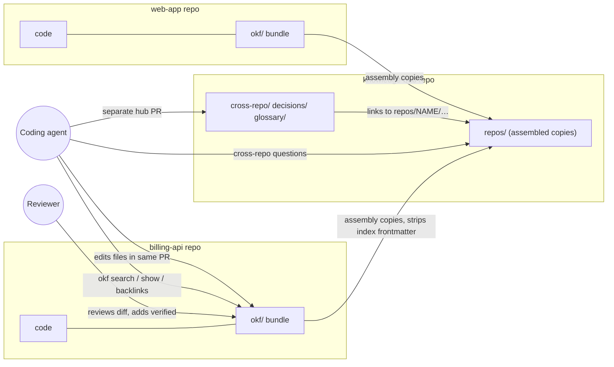
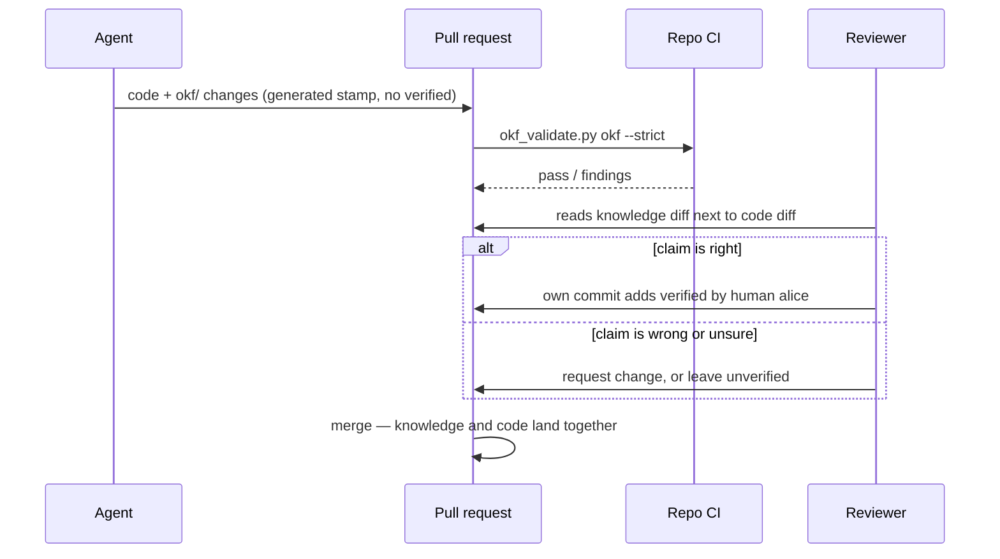
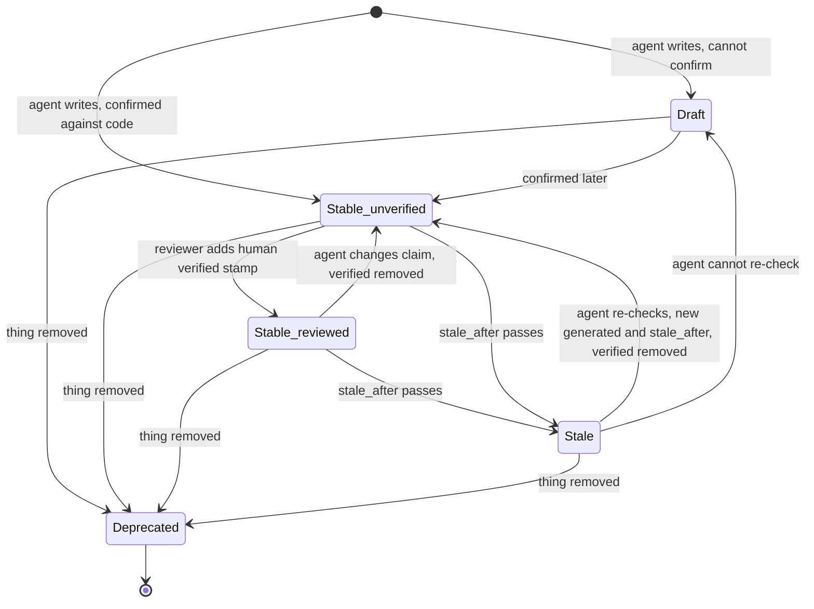

# How the OKF knowledge system works: interactions and UX

Date: 2026-09-29. Status: design. It builds on the
[research report](../research/okf-knowledge-system.md). Nothing is installed yet.

## Gist

The system adds no new app or server. People and agents use tools they already
have: markdown files in each repo, one CLI (`okf`), one agent skill, pull
request review, and CI. It runs as a loop:

1. **Read.** Before a task, the agent reads what the repo knows.
2. **Work and write.** The agent records what it learned in the same pull request as the code.
3. **Review.** A human checks that knowledge in the normal diff and can mark it verified.
4. **Assemble.** One script copies every repo's knowledge into a hub view, so
   cross-repo questions can be answered. Agents run it before a cross-repo
   question; hub CI runs it nightly to catch broken cross-repo links.

The main UX risks:

- Search results do not show trust or staleness, so the agent needs a second call.
- The hub view is only as fresh as its last assembly, and each assembly
  fetches every repo.
- Nothing stops an agent from writing a fake "human verified" stamp. Only review catches it.
- Until okfcli#34 is fixed, `okf validate` rejects the datetime `stale_after`
  this design requires, and `okf show` never reports a concept as stale.

Command output in this document is real. It comes from okfcli v0.5.0, re-run
for this document on the research test data (`/tmp/okf-research/fixture`) and,
for hub queries, on the prototype built with the report's conventions
(`/tmp/okf-research/proto/ws`). The skill, the fetching assembly script and the
hub CI job are proposals. Section 9 lists what does not exist yet.

## 1. The original problem

The research set out to give coding agents a knowledge system that works
across 10–50+ repos. The research contract was only partly retrievable, so
this list is rebuilt from the report and its test protocol. It has five needs:

| # | Need | What goes wrong today |
|---|---|---|
| N1 | Agents start each task knowing why the code is the way it is | Every session starts blank. The agent re-derives knowledge or repeats a known mistake, such as retrying an invoice call without an idempotency key. |
| N2 | Agents can update that knowledge as a normal part of their work | What agents learn stays in chat logs and is lost |
| N3 | Humans can check agent-written knowledge cheaply | Agent notes are either trusted blindly or ignored |
| N4 | Knowledge covers how repos depend on each other | A change in one repo breaks another, and no single repo records the link |
| N5 | Knowledge stays current and portable across agents and tools | Notes rot, and a tool-specific store locks the team in |

Section 7 maps each need to the part of the system that meets it.

## 2. Who and what is involved

People and machines:

| Actor | Role |
|---|---|
| Coding agent | Claude Code, Cursor or omp, working in one repo with the skill loaded |
| Developer | Works next to the agent and asks it questions |
| Reviewer | Reviews pull requests. Is the only one who adds `verified: human:<login>` stamps. |
| Repo CI | Checks that the repo's `okf/` folder follows the format on every pull request |
| Hub CI | Assembles every repo each night, or when a repo pipeline asks for it, and fails on broken cross-repo links |

Artifacts:

| Artifact | Where | Written by |
|---|---|---|
| Repo bundle | `<repo>/okf/`: one markdown file per concept | Agents and developers, in code pull requests |
| Hub repo | `knowledge-hub/`: cross-repo dependencies, shared decisions, glossary | Agents and developers, in hub pull requests |
| Assembled hub view | `knowledge-hub/repos/<name>/`: copies of every repo bundle, ignored by git | Assembly script only, run locally or in hub CI |
| Skill | One `SKILL.md` that every agent loads | The platform team |



## 3. What each actor touches

| Actor | Uses | Never does |
|---|---|---|
| Coding agent | Six commands: `okf search`, `show`, `list`, `backlinks`, `index`, `validate` (the okf-skills validator stands in for `validate` until okfcli#34 is fixed). Plain file edits. | Adds a `human:` verified stamp; edits `knowledge-hub/repos/`; links from one repo bundle into another repo's files |
| Developer | Reads the markdown on GitHub or in an editor. Asks the agent. Runs the assembly script locally for cross-repo work. | Needs to learn the CLI to benefit |
| Reviewer | The pull request diff, usually 1–3 knowledge files. Adds one `verified` line in their own commit. | Approves a `verified: human:` line they did not write |
| Repo CI | `okf_validate.py okf --strict` from okf-skills | Changes any files |
| Hub CI | Assembly script, strict validator, broken-link report | Writes back into repos |

**The UX choice: the interface is the file.** Tools that rewrite frontmatter
made noisy diffs; one tag change became a 17-line diff (report, finding 6).
Plain file edits kept every change to 1–3 files. So reviewers read knowledge
changes the way they read code.

## 4. Journeys

### 4.1 An agent starts a task in one repo

The task: "Add retries to the invoice client in billing-api."

1. The skill applies because the repo has an `okf/` folder. Agents load a
   skill only when its description matches the task, so each repo's
   `AGENTS.md` (or `CLAUDE.md`) also has one line pointing at `okf/index.md`
   and the skill (section 4.8). [INFERENCE: skill auto-loading was not tested.]
2. The agent reads `okf/index.md`, then `okf/overview.md`. The test data has no
   `overview.md`; section 4.8 adds one to every repo.
3. It searches for the task's key words:

   ```
   $ okf search okf --text idempotency
   "count": 3,
   "results": [
     {"id": "contracts/invoice-api",   "title": "Invoice API v2", "type": "API Contract"},
     {"id": "gotchas/idempotency-key", "title": "Invoice creation needs an idempotency key", "type": "Gotcha"},
     {"id": "services/billing-api",    "title": "Billing API", "type": "Service"}]
   ```

4. Search hits show only the id, title and type. One `okf list okf` call adds
   `status` and `trust_tier` for every concept in the bundle, but not
   staleness. So the agent opens each hit it will rely on:

   ```
   $ okf show okf gotchas/idempotency-key
   "description": "POST /v2/invoices double-charges on retry without Idempotency-Key.",
   "generated":   {"at": "2026-06-01T12:00:00Z", "by": "cursor/gpt-5.6"},
   "stale_after": "2026-09-01T00:00:00Z",
   "stale": false,            <- wrong: the date has passed (okfcli#34)
   "status": "draft",
   "trust_tier": "unverified"
   ```

5. The concept is a draft, unverified and past its `stale_after` date.
   `okf show` still says `stale: false` because of okfcli#34. Until that is
   fixed, the skill tells the agent to compare `stale_after` with today's date
   itself. The agent treats the concept as a lead to check, not a fact
   (section 6). It reads the handler code and confirms that retries without
   the key double-charge.
6. The agent writes the retry code, and it sends the key.

This single read could prevent a double-charge bug. The agent still checked
the claim, because the concept's trust level told it to.

### 4.2 The agent records what it learned

The agent updates the knowledge in the same branch as the code:

1. It edits `okf/gotchas/idempotency-key.md`. It sets `status: stable`, adds
   `sources` pointing at the handler, and adds a new `generated` stamp and a
   new `stale_after`. If the concept had `verified` entries, it removes them,
   because a stamp covers only the text a human checked (section 5):

   ```yaml
   status: stable
   generated: { by: claude-code/opus-5, at: 2026-09-29T14:00:00Z }
   stale_after: 2027-03-28T14:00:00Z
   sources:
     - id: create-invoice
       resource: https://github.com/acme/billing-api/blob/main/internal/invoice/create.go
   ```

2. It changes the root-relative link `/contracts/invoice-api.md` to
   `../contracts/invoice-api.md`. Links starting with `/` break inside the hub
   (section 4.4).
3. If it learned something new, for example a retry budget, it writes a new
   file, `okf/gotchas/retry-budget.md`, with one concept in it.
4. It runs `okf index okf` and the okf-skills validator
   (`okf_validate.py okf --strict`), the same check repo CI runs. That
   validator passes on the edit above. `okf validate okf` rejects it
   ("'stale_after' must be an absolute YYYY-MM-DD date"), so the agent uses it
   only after okfcli#34 is fixed. The research test of this path produced a
   1–3 file diff (okfcli evidence, test T7).
5. It does not add `verified`. The pull request description lists the
   knowledge files it changed, so the reviewer can find them.

What the agent must not record: facts the code already states plainly, copied
code, or secrets. Knowledge explains why, how things connect, and what
surprises people.

### 4.3 The reviewer checks and verifies



- The reviewer reads the knowledge change in the same diff as the code it
  describes. They do not need a second tool.
- Verifying adds one line. In the research test it produced a one-line diff,
  and the regenerated index files did not change.
- After merge, `okf list` and `okf show` report `trust_tier: human-reviewed`.
  Future agents treat the concept as reliable.
- A reviewer may merge the code and leave the knowledge unverified. Unverified
  knowledge is still useful. Agents just check it first.
- The proof of who added a `human:` stamp is the pull request, not the commit.
  A squash merge folds the reviewer's commit into one commit authored by the
  pull request author. So a later check should match the stamp's login
  against the reviewers who approved that pull request, not against commit
  authors.

### 4.4 An agent answers a cross-repo question

The task, in billing-api: "Change the response shape of POST /v2/invoices."
The agent first asks who depends on that contract.

1. A single repo cannot answer this, so the agent uses the assembled hub. The
   developer has `knowledge-hub` checked out, and the agent refreshes its view:

   ```
   $ assemble-hub.sh ~/src/knowledge-hub
   ```

   The script reads `repos.txt` and fetches only the `okf/` folder of each
   listed repo from its git remote. It copies each one into `repos/<name>/`
   and removes frontmatter from the copied `index.md` files. Hub CI runs the
   same script. The developer needs read access to every listed repo, but no
   local checkout of any of them. Copying 50 repos took 2.9 s in the
   research; fetching them was not measured. [INFERENCE: with shallow sparse
   clones kept between runs, a refresh is one `git fetch` per repo.]
2. It asks for backlinks, meaning every concept that links to this one:

   ```
   $ okf backlinks ~/src/knowledge-hub repos/billing-api/contracts/invoice-api
   "backlinks": [
     "cross-repo/invoice-dependency",
     "repos/billing-api/gotchas/idempotency-key",
     "repos/billing-api/services/billing-api"],
   "count": 3
   ```

3. Only `cross-repo/…` and `repos/<other repo>/…` entries are dependents. The
   other two are billing-api's own concepts. The one dependent here is
   `cross-repo/invoice-dependency`, a hub concept verified by `human:alice`.
   It says: "Breaking changes to the contract need a web-app release first."
4. The agent stops before the breaking change. It tells the developer that
   web-app must ship first, citing the concept. It can then offer an additive
   change instead.

At 10,000 concepts, search took 0.37 s and backlinks 0.34 s (medians). So the
agent can run these checks by default.

### 4.5 Recording a cross-repo fact

Say the agent finds, while working in web-app, that checkout now also calls
shared-auth's session endpoint.

1. The web-app pull request records only web-app facts in `web-app/okf/`. It
   may cite shared-auth by GitHub URL, but it does not link to shared-auth's
   files.
2. The agent opens a separate hub pull request as a draft. It adds
   `cross-repo/web-app-session-dependency.md` with type `Cross-Repo Dependency`,
   linking `/repos/web-app/…` and `/repos/shared-auth/…`.
3. Hub CI assembles the repos and runs the validator with `--strict`, which
   fails on any broken link. Until the web-app pull request merges, a link to
   a concept it adds is broken, so the hub pull request stays red. Once the
   web-app pull request merges, CI re-runs green and the hub pull request is
   marked ready for review.

Cross-repo links live only in the hub, because the OKF spec has no way to link
between bundles (report, finding 4). This rule keeps every repo bundle valid
when read on its own.

### 4.6 Knowledge goes stale or turns out wrong

| Trigger | What the agent does |
|---|---|
| The code contradicts a concept | Fixes the concept in the same pull request (section 4.2) |
| The concept is past `stale_after` | Checks the claim against the code, then updates `generated` and `stale_after` and removes any `verified` entries, so a reviewer verifies again. If it cannot check the claim, it sets `status: draft` and says why. |
| The thing described was removed | Sets `status: deprecated`. It does not delete the file, so inbound links still resolve. |
| The agent cannot reach the code, such as another repo's internals | Sets `status: draft` and gives the reason in the body |

`stale_after` is required for `API Contract` and `Gotcha`. The default is 180
days. Once okfcli#34 is fixed, `okf show` reports `stale: true` for these
concepts; until then the agent compares `stale_after` with today's date. Stale
concepts come up as agents meet them during tasks, not in a separate cleanup
job.

### 4.7 Renaming or moving a concept

Moves should be rare. They are a manual, human-led step:

1. Before moving, run `okf backlinks` on a freshly assembled hub for the old
   path. Note the hub concepts in the result (`cross-repo/…`, `decisions/…`).
2. In the repo, run `okfctl node mv <old> <new> --bundle okf --dry-run`,
   then run it for real. It rewrites the inbound links inside that repo. It
   also appends to `log.md` and regenerates the index files, replacing the
   root `index.md` prose. Run `okf index okf` afterwards so the index files
   match what okfcli writes.
3. After the repo pull request merges, the same person opens a hub pull
   request fixing the links from step 1. Nightly hub CI fails on any link that
   was missed, and the hub's CODEOWNERS get the failure.

### 4.8 Adding a repo

1. Create `okf/index.md` with `okf_version: "0.2"`, plus `okf/overview.md`
   (type `Overview`).
2. Add the okf-skills validator to the repo's CI.
3. Add one line to the repo's `AGENTS.md` (or `CLAUDE.md`): read
   `okf/index.md` and follow the OKF skill before starting work.
4. Add the repo's name and git URL to `knowledge-hub/repos.txt`.
5. Agents fill in knowledge as they work. The okf-skills `backfill` command
   can draft concepts from git history as `status: draft`, but it was not
   tested.

## 5. Life of a concept

The spec defines `status` as one of `draft`, `stable` or `deprecated`. Trust
is separate: tools derive a `trust_tier` from the `verified` entries. The tiers
are `unverified`, `machine-confirmed` (a `process:` verifier) and
`human-reviewed`.



A `verified` entry covers only the text that was checked. The tools do not
track this: in a test, a concept whose `verified.at` was older than its
`generated.at` still showed `trust_tier: human-reviewed`. So the skill adds two
rules:

- Whenever an agent writes a new `generated` stamp, it removes the concept's
  `verified` entries and says so in the pull request, so the reviewer can
  verify again. Agents may remove a stamp; they never add a `human:` one.
- When reading, the agent counts a `verified` entry only if its `at` is at or
  after `generated.at`. This catches edits that skipped the first rule.

## 6. How the agent decides what to trust

The skill turns the fields on a concept into an action. Check the rows in
order; the first match wins. "Stale" means `stale_after` is in the past; until
okfcli#34 is fixed, the agent compares the date itself. A `verified` entry
counts only if its `at` is at or after `generated.at` (section 5).

| Concept | Agent behavior |
|---|---|
| `deprecated` | Do not follow it. Look for what replaced it. |
| `draft`, or stale | Treat it as a lead only. Confirm it, then fix or refresh it (section 4.6). |
| `human-reviewed` | Rely on it. Cite it when it drives a decision. |
| `machine-confirmed` | Rely on it for what the machine check covers, such as a contract matching its OpenAPI file |
| `unverified` | Use it as a strong lead. Confirm against the code before a risky change. |

Two rules for backlinks:

- Empty backlinks can mean no links or a mistyped ID. okfcli returns
  `count 0` in both cases, so check the ID with `okf list`.
- In the hub, only `cross-repo/…` and `repos/<other repo>/…` entries are
  dependents. Entries from the concept's own repo are not.

## 7. How this solves the original problem

| Need | Mechanism | Evidence | What remains |
|---|---|---|---|
| N1: agents start informed | Skill step "before starting work", plus a pointer line in `AGENTS.md`; search, then list or show; trust rules in section 6 | Search 0.37 s and backlinks 0.34 s at 10,000 concepts; correct hits on the test data | Search hits lack trust and status, so the agent needs a second call; plain substring matching with no ranking |
| N2: agents update knowledge in normal work | Plain file edits in the same pull request, then `okf index` and the validator | 1–3 file diffs; unknown frontmatter keys kept on disk | `okf index` overwrites hand-written `index.md` prose, so prose goes in `overview.md`; `okf validate` rejects datetime `stale_after` until okfcli#34 is fixed |
| N3: cheap human checks | Knowledge sits in the code diff; one-line `verified` stamp; stamps removed when the claim changes; CI validation | A one-line verify diff; strict validator clean on the prototype | Nothing enforces who writes a `human:` stamp. Review is the only check; a later check could match the stamp's login against the pull request's approving reviewers (section 4.3). |
| N4: cross-repo knowledge | Hub `Cross-Repo Dependency` concepts plus an assembled view of all repos, fetched from their remotes | 3 correct backlinks on the prototype hub, including the cross-repo edge; 50-repo copy in 2.9 s | The view is only as fresh as its last assembly; fetch time for 50 repos was not measured |
| N5: current and portable | `stale_after`, `deprecated`, and agents fixing contradictions as they go; plain OKF files; skill depends on six commands | Every tool read the same files; a CLI swap only touches the skill | Staleness detection needs okfcli#34 fixed |

## 8. What users see when something breaks

| Failure | What the user or agent sees | Handling |
|---|---|---|
| Hub built with symlinks instead of copies | Validation passes but loads 0 repo concepts: a false pass | The assembly script only copies. Hub CI should fail when the concept count drops sharply [INFERENCE: not built]. |
| Repo bundle uses a `/…` link | Passes in the repo, reported broken in the hub | Hub CI reports it. The skill forbids `/…` links in repo bundles. The re-run test data shows exactly this finding for `idempotency-key`. |
| `stale_after` in the spec's datetime form (okfcli#34) | `okf validate` errors; `okf show` says `stale: false` for a stale concept | Fix upstream, or pin a patched fork before rollout |
| Agent writes `verified: human:…` itself | Concept shows as `human-reviewed` | Caught only in review. The skill forbids it. |
| Agent changes a reviewed concept but keeps its `verified` entry | Tools still show `human-reviewed` | The skill ignores a stamp older than `generated.at` (section 5). The reviewer sees the kept stamp in the diff. |
| Hub pull request links a concept that is not merged yet | Hub CI fails on the broken link | Open the hub pull request as a draft and mark it ready after the repo pull request merges (section 4.5) |
| Search term inside backticks, such as `` `Idempotency-Key` `` | okfcli finds it; okf-mcp did not | Re-test any replacement search tool against this case |
| Moved file breaks links from the hub | Nightly hub CI fails; the hub's CODEOWNERS are notified | Section 4.7 |

## 9. What does not exist yet

These are needed before the journeys above work end to end. Section 8 of the
report lists them.

1. A fix for okfcli#34, upstream or in a pinned fork.
2. The skill: the section 6 outline in the report, plus sections 4.1–4.6, 5
   and 6 of this document written as agent instructions.
3. The real assembly script, which fetches `okf/` from the git remotes in
   `repos.txt`, and the hub CI job. The current script is a 15-line prototype
   that reads from a local workspace folder.
4. A pilot with 2–3 repos, measuring:
   - how often agents write knowledge;
   - how often reviewers correct it;
   - how often agents run into stale concepts.
