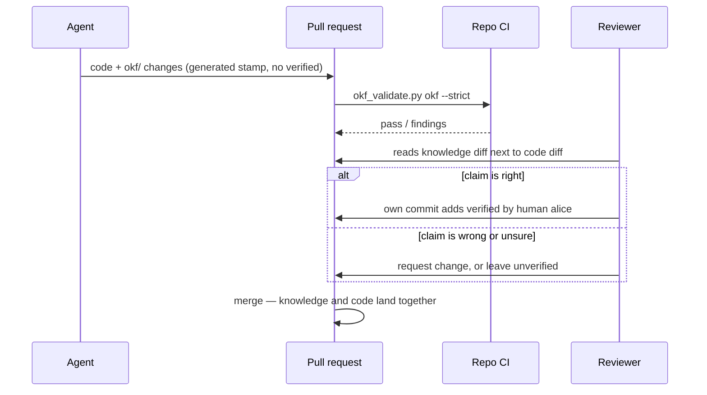
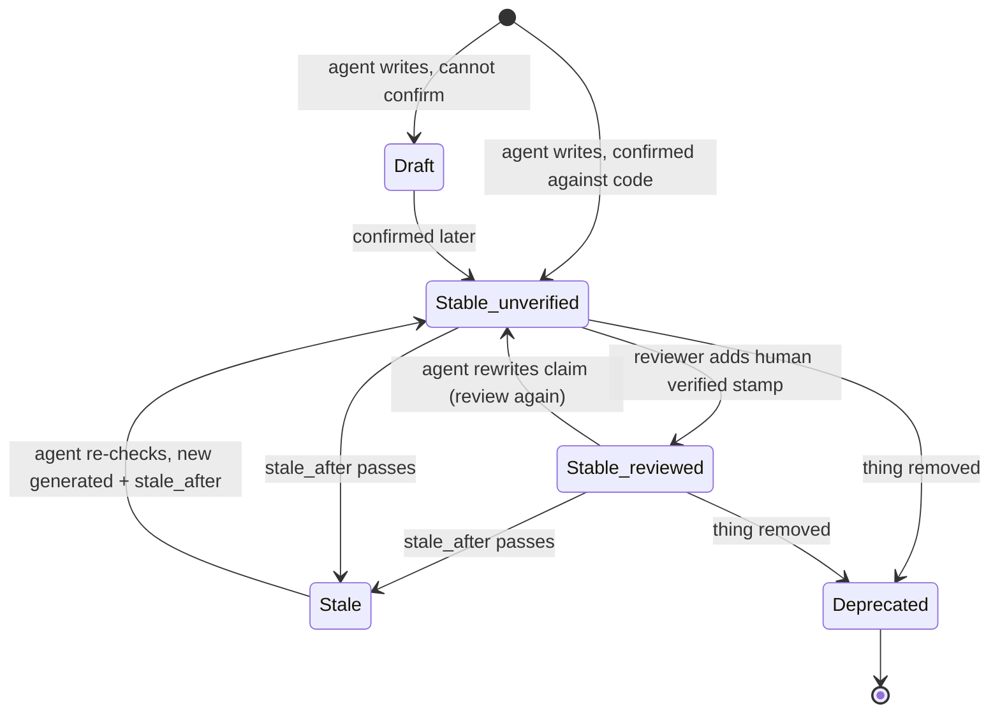

# How the OKF knowledge system works: interactions and UX

Date: 2026-09-29. Status: design. It builds on the
[research report](../research/okf-knowledge-system.md). Nothing is installed yet.

## Gist

The system adds no new app or server. People and agents use tools they already
have: markdown files in each repo, one CLI (`okf`), one agent skill, pull
request review, and CI. It runs as a loop:

1. **Read.** Before a task, the agent reads what the repo knows.
2. **Work and write.** The agent records what it learned in the same pull request as the code.
3. **Review.** A human checks that knowledge in the normal diff and can mark it verified.
4. **Assemble.** A nightly job copies every repo's knowledge into a hub, so cross-repo questions can be answered.

The main UX risks:

- Search results do not show trust or staleness, so the agent needs a second call.
- The hub's cross-repo view can be up to one CI run behind.
- Nothing stops an agent from writing a fake "human verified" stamp. Only review catches it.

Command output in this document is real. It comes from okfcli v0.5.0 run on
the research test data (`/tmp/okf-research/fixture`), re-run for this document.
The skill and the hub CI job are proposals. Section 9 lists what does not
exist yet.

## 1. The original problem

The research set out to give coding agents a knowledge system that works
across 10–50+ repos. The research contract was only partly retrievable, so
this list is rebuilt from the report and its test protocol. It has five needs:

| # | Need | What goes wrong today |
|---|---|---|
| N1 | Agents start each task knowing why the code is the way it is | Every session starts blank. The agent re-derives knowledge or repeats a known mistake, such as retrying an invoice call without an idempotency key. |
| N2 | Agents can update that knowledge as a normal part of their work | What agents learn stays in chat logs and is lost |
| N3 | Humans can check agent-written knowledge cheaply | Agent notes are either trusted blindly or ignored |
| N4 | Knowledge covers how repos depend on each other | A change in one repo breaks another, and no single repo records the link |
| N5 | Knowledge stays current and portable across agents and tools | Notes rot, and a tool-specific store locks the team in |

Section 7 maps each need to the part of the system that meets it.

## 2. Who and what is involved

People and machines:

| Actor | Role |
|---|---|
| Coding agent | Claude Code, Cursor or omp, working in one repo with the skill loaded |
| Developer | Works next to the agent and asks it questions |
| Reviewer | Reviews pull requests. Is the only one who adds `verified: human:<login>` stamps. |
| Repo CI | Checks that the repo's `okf/` folder follows the format on every pull request |
| Hub CI | Builds the cross-repo view each night, or when a repo pipeline asks for it |

Artifacts:

| Artifact | Where | Written by |
|---|---|---|
| Repo bundle | `<repo>/okf/`: one markdown file per concept | Agents and developers, in code pull requests |
| Hub repo | `knowledge-hub/`: cross-repo dependencies, shared decisions, glossary | Agents and developers, in hub pull requests |
| Assembled hub view | `knowledge-hub/repos/<name>/`: copies of every repo bundle, ignored by git | Assembly script only |
| Skill | One `SKILL.md` that every agent loads | The platform team |


## 3. What each actor touches

| Actor | Uses | Never does |
|---|---|---|
| Coding agent | Six commands: `okf search`, `show`, `list`, `backlinks`, `index`, `validate`. Plain file edits. | Adds a `human:` verified stamp; edits `hub/repos/`; links from one repo bundle into another repo's files |
| Developer | Reads the markdown on GitHub or in an editor. Asks the agent. Runs the assembly script locally for cross-repo work. | Needs to learn the CLI to benefit |
| Reviewer | The pull request diff, usually 1–3 knowledge files. Adds one `verified` line in their own commit. | Approves a `verified: human:` line they did not write |
| Repo CI | `okf_validate.py okf --strict` from okf-skills | Changes any files |
| Hub CI | Assembly script, strict validator, broken-link report | Writes back into repos |

**The UX choice: the interface is the file.** Tools that rewrite frontmatter
made noisy diffs; one tag change became a 17-line diff (report, finding 6).
Plain file edits kept every change to 1–3 files. So reviewers read knowledge
changes the way they read code.

## 4. Journeys

### 4.1 An agent starts a task in one repo

The task: "Add retries to the invoice client in billing-api."

1. The skill triggers because the repo has an `okf/` folder.
2. The agent reads `okf/index.md`, then `okf/overview.md`.
3. It searches for the task's key words:

   ```
   $ okf search okf --text idempotency
   "count": 3,
   "results": [
     {"id": "contracts/invoice-api",   "title": "Invoice API v2", "type": "API Contract"},
     {"id": "gotchas/idempotency-key", "title": "Invoice creation needs an idempotency key", "type": "Gotcha"},
     {"id": "services/billing-api",    "title": "Billing API", "type": "Service"}]
   ```

4. Search hits show only the id, title and type. To learn how far it can trust
   each hit, the agent opens the ones it will rely on:

   ```
   $ okf show okf gotchas/idempotency-key
   "description": "POST /v2/invoices double-charges on retry without Idempotency-Key.",
   "generated":   {"at": "2026-06-01T12:00:00Z", "by": "cursor/gpt-5.6"},
   "stale_after": "2026-09-01T00:00:00Z",
   "stale": false,            <- wrong: the date has passed (okfcli#34)
   "status": "draft",
   "trust_tier": "unverified"
   ```

5. The concept is a draft, unverified and past its `stale_after` date. The
   agent treats it as a lead to check, not a fact (section 6). It reads the
   handler code and confirms that retries without the key double-charge.
6. The agent writes the retry code, and it sends the key.

This single read could prevent a double-charge bug. The agent still checked
the claim, because the concept's trust level told it to.

### 4.2 The agent records what it learned

The agent updates the knowledge in the same branch as the code:

1. It edits `okf/gotchas/idempotency-key.md`. It sets `status: stable`, adds
   `sources` pointing at the handler, and adds a new `generated` stamp and a
   new `stale_after`:

   ```yaml
   status: stable
   generated: { by: claude-code/opus-5, at: 2026-09-29T14:00:00Z }
   stale_after: 2027-03-28T14:00:00Z
   sources:
     - id: create-invoice
       resource: https://github.com/acme/billing-api/blob/main/internal/invoice/create.go
   ```

2. It changes the root-relative link `/contracts/invoice-api.md` to
   `../contracts/invoice-api.md`. Links starting with `/` break inside the hub
   (section 4.4).
3. If it learned something new, for example a retry budget, it writes a new
   file, `okf/gotchas/retry-budget.md`, with one concept in it.
4. It runs `okf index okf` and `okf validate okf`. The research test of this
   path produced a 1–3 file diff (okfcli evidence, test T7).
5. It does not add `verified`. The pull request description lists the
   knowledge files it changed, so the reviewer can find them.

What the agent must not record: facts the code already states plainly, copied
code, or secrets. Knowledge explains why, how things connect, and what
surprises people.

### 4.3 The reviewer checks and verifies



- The reviewer reads the knowledge change in the same diff as the code it
  describes. They do not need a second tool.
- Verifying adds one line. In the research test it produced a one-line diff,
  and the regenerated index files did not change.
- After merge, `okf list` and `okf show` report `trust_tier: human-reviewed`.
  Future agents treat the concept as reliable.
- A reviewer may merge the code and leave the knowledge unverified. Unverified
  knowledge is still useful. Agents just check it first.

### 4.4 An agent answers a cross-repo question

The task, in billing-api: "Change the response shape of POST /v2/invoices."
The agent first asks who depends on that contract.

1. A single repo cannot answer this, so the agent uses the assembled hub. The
   developer has `knowledge-hub` checked out next to the other repos, and the
   agent refreshes it:

   ```
   $ assemble-hub.sh ~/src ~/src/knowledge-hub billing-api web-app shared-auth
   ```

   The script copies each repo's `okf/` into `repos/<name>/` and removes
   frontmatter from the copied `index.md` files. For 50 repos it took 2.9 s.
2. It asks for backlinks, meaning every concept that links to this one:

   ```
   $ okf backlinks ~/src/knowledge-hub repos/billing-api/contracts/invoice-api
   "backlinks": [
     "cross-repo/invoice-dependency",
     "repos/billing-api/services/billing-api",
     "repos/web-app/services/web-app"],
   "count": 3
   ```

3. `cross-repo/invoice-dependency` is a hub concept verified by `human:alice`.
   It says: "Breaking changes to the contract need a web-app release first."
4. The agent stops before the breaking change. It tells the developer that
   web-app must ship first, citing the concept. It can then offer an additive
   change instead.

At 10,000 concepts, search and backlinks each took 0.35 s. So the agent can
run these checks by default.

### 4.5 Recording a cross-repo fact

Say the agent finds, while working in web-app, that checkout now also calls
shared-auth's session endpoint.

1. The web-app pull request records only web-app facts in `web-app/okf/`. It
   may cite shared-auth by GitHub URL, but it does not link to shared-auth's
   files.
2. The agent opens a separate hub pull request. It adds
   `cross-repo/web-app-session-dependency.md` with type `Cross-Repo Dependency`,
   linking `/repos/web-app/…` and `/repos/shared-auth/…`.
3. Hub CI assembles the repos and validates the hub. A link to a concept that
   does not exist yet shows up as a broken-link finding. This happens, for
   example, when the web-app pull request has not merged.

Cross-repo links live only in the hub, because the OKF spec has no way to link
between bundles (report, finding 4). This rule keeps every repo bundle valid
when read on its own.

### 4.6 Knowledge goes stale or turns out wrong

| Trigger | What the agent does |
|---|---|
| The code contradicts a concept | Fixes the concept in the same pull request (section 4.2) |
| The concept is past `stale_after` | Checks the claim against the code, then updates `generated` and `stale_after`. If it cannot check the claim, it sets `status: draft` and says why. |
| The thing described was removed | Sets `status: deprecated`. It does not delete the file, so inbound links still resolve. |
| The agent cannot reach the code, such as another repo's internals | Sets `status: draft` and gives the reason in the body |

`stale_after` is required for `API Contract` and `Gotcha`. The default is 180
days. Once okfcli#34 is fixed, `okf show` reports `stale: true` for these
concepts. Stale concepts then come up as agents meet them during tasks, not in
a separate cleanup job.

### 4.7 Renaming or moving a concept

Moves should be rare. They are a manual, human-led step:

1. In the repo, run `okfctl node mv <old> <new> --bundle okf --dry-run`,
   then run it for real. It rewrites the inbound links inside that repo.
2. The next hub assembly reports hub concepts that still point at the old
   path. Someone fixes them in a hub pull request.

### 4.8 Adding a repo

1. Create `okf/index.md` with `okf_version: "0.2"`, plus `okf/overview.md`
   (type `Overview`).
2. Add the okf-skills validator to the repo's CI.
3. Add the repo's name and git URL to `knowledge-hub/repos.txt`.
4. Agents fill in knowledge as they work. The okf-skills `backfill` command
   can draft concepts from git history as `status: draft`, but it was not
   tested.

## 5. Life of a concept

The spec defines `status` as one of `draft`, `stable` or `deprecated`. Trust
is separate: tools derive a `trust_tier` from the `verified` entries. The tiers
are `unverified`, `machine-confirmed` (a `process:` verifier) and
`human-reviewed`.



When an agent changes the substance of a human-reviewed concept, the old
`verified` entry no longer covers the new text. The skill has the agent point
this out in the pull request, so the reviewer can verify again. [INFERENCE:
no tool tested removes or expires a `verified` entry when the body changes.
This rule is our convention.]

## 6. How the agent decides what to trust

The skill turns the fields on a concept into a simple action:

| What `okf show` reports | Agent behavior |
|---|---|
| `stable`, `human-reviewed`, not stale | Rely on it. Cite it when it drives a decision. |
| `stable`, `machine-confirmed` | Rely on it for what the machine check covers, such as a contract matching its OpenAPI file |
| `stable`, `unverified` | Use it as a strong lead. Confirm against the code before a risky change. |
| `draft`, or past `stale_after` | Treat it as a lead only. Confirm it, then fix or refresh it (section 4.6). |
| `deprecated` | Do not follow it. Look for what replaced it. |
| Empty backlinks | This can mean no links or a mistyped ID. okfcli returns `count 0` in both cases, so check the ID with `okf list`. |

## 7. How this solves the original problem

| Need | Mechanism | Evidence | What remains |
|---|---|---|---|
| N1: agents start informed | Skill step "before starting work"; search, then show; trust rules in section 6 | Search 0.35 s and backlinks 0.34 s at 10,000 concepts; correct hits on the test data | Search hits lack trust and status, so the agent needs two calls; plain substring matching with no ranking |
| N2: agents update knowledge in normal work | Plain file edits in the same pull request, then `okf index` and `okf validate` | 1–3 file diffs; unknown frontmatter keys kept on disk | `okf index` overwrites hand-written `index.md` prose, so prose goes in `overview.md` |
| N3: cheap human checks | Knowledge sits in the code diff; one-line `verified` stamp; CI validation | A one-line verify diff; strict validator clean on the prototype | Nothing enforces who writes a `human:` stamp. Review is the only check; a CODEOWNERS or commit-author check could be added later. |
| N4: cross-repo knowledge | Hub `Cross-Repo Dependency` concepts plus an assembled view of all repos | 3 correct cross-repo backlinks; 50-repo assembly in 2.9 s; re-run for this document | Lags the repos by up to one assembly; locally, the view is only as fresh as the developer's checkouts |
| N5: current and portable | `stale_after`, `deprecated`, and agents fixing contradictions as they go; plain OKF files; skill depends on six commands | Every tool read the same files; a CLI swap only touches the skill | Staleness detection needs okfcli#34 fixed |

## 8. What users see when something breaks

| Failure | What the user or agent sees | Handling |
|---|---|---|
| Hub built with symlinks instead of copies | Validation passes but loads 0 repo concepts: a false pass | The assembly script only copies. Hub CI should fail when the concept count drops sharply [INFERENCE: not built]. |
| Repo bundle uses a `/…` link | Passes in the repo, reported broken in the hub | Hub CI reports it. The skill forbids `/…` links in repo bundles. The re-run test data shows exactly this finding for `idempotency-key`. |
| `stale_after` in the spec's datetime form (okfcli#34) | `okf validate` errors; `okf show` says `stale: false` for a stale concept | Fix upstream, or pin a patched fork before rollout |
| Agent writes `verified: human:…` itself | Concept shows as `human-reviewed` | Caught only in review. The skill forbids it. |
| Search term inside backticks, such as `` `Idempotency-Key` `` | okfcli finds it; okf-mcp did not | Re-test any replacement search tool against this case |
| Moved file breaks links from other repos | Hub broken-link report after the next assembly | Section 4.7 |

## 9. What does not exist yet

These are needed before the journeys above work end to end. Section 8 of the
report lists them.

1. A fix for okfcli#34, upstream or in a pinned fork.
2. The skill: the section 6 outline in the report, plus sections 4.1–4.6 and 6
   of this document written as agent instructions.
3. The real assembly script and the hub CI job. The current script is a
   15-line prototype that reads from a workspace folder, not from git remotes.
4. A pilot with 2–3 repos, measuring:
   - how often agents write knowledge;
   - how often reviewers correct it;
   - how often agents run into stale concepts.
