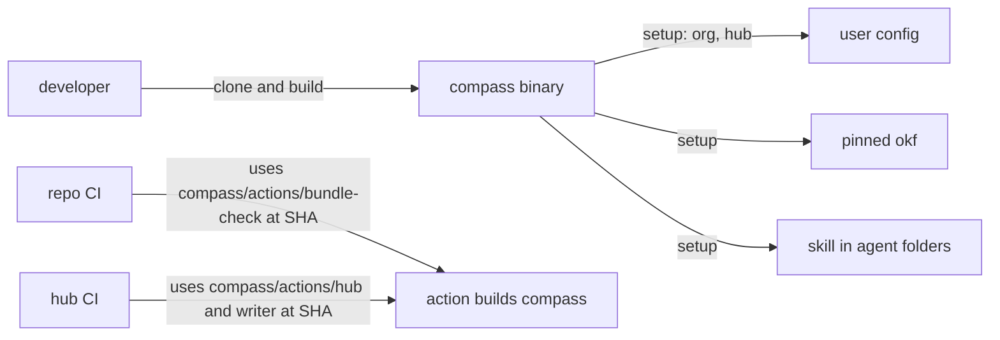

# Move the OKF tooling into compass as one Go CLI

## Overview

**Problem:** The tooling lives in a separate repo, `okf-tools`, as a set of bash and Python scripts with no single entry point. The user wants compass to hold all of it: clone compass, build the tool, run a setup that asks for the knowledge hub, and continue from there.
**Change:** Rebuild the `okf-tools` scripts as one Go binary, `compass`, inside the compass repo. Move the CI actions, templates, test data and skill with it. Push compass. Repoint the hub and the scratch repos to compass, then delete `okf-tools`.
**Why this way:** The user chose a Go binary, connect-only setup, pushing compass and deleting `okf-tools` (decisions 1–4). The strongest rejected alternative kept the tested scripts and added a thin `compass` wrapper: no rewrite, but no build step and two runtimes. The main risk is behavior lost in the rewrite; the existing test suites are carried over as end-to-end checks against the binary, so every case they cover today must still pass.

This plan supersedes four decisions of `260929-1607-okf-knowledge-system-rollout`: decision 1 (code home), decision 7 (languages), decision 11 (what the actions run), and decision 17 (the installer). That plan's phases 01, 02 and 07 are done and their evidence stands. Its phase 04 is half done: the hub and scratch repos exist, but no live run has happened. Phases 03, 05 and 08 have code in `okf-tools` that this plan carries over. That plan resumes when this one closes, with compass as the code home.

What stays as it is:

- **The `tuan-nng/okf` fork** and its release `v0.5.0-tuan-nng.1`. okfcli keeps its code under `internal/`, so Go does not allow compass to import it as a library. `compass` installs and calls the pinned `okf` binary, checked by sha256, as `okf-tools` does today.
- **`tuan-nng/knowledge-hub`** and its content. Only its workflow files change.
- **The org name as configuration.** `config.env` in compass holds `OKF_ORG`; the environment overrides it; hub actions pass the repository owner.

## Decisions

Confirmed with the user on 2026-10-06:

1. **Code home: compass.** All tooling code, actions, templates, test data and the skill live in compass. Compass gets pushed to `tuan-nng/compass`, which already exists, and stays private. Its Actions access opens to the account's private repos, as `okf-tools` does today. This replaces the earlier rule that compass is never pushed. The rejected alternative kept compass local and published the actions from a second repo, which means two places to keep in sync.
2. **One Go binary.** `compass` replaces every `okf-tools` script with a subcommand. It uses only the Go standard library plus `gopkg.in/yaml.v3`, the YAML library okfcli already uses. The rejected alternative was a thin script wrapper around the existing bash and Python. It needs no rewrite, but users would need bash, Python 3.11, uv and the tool's own scripts at runtime.
3. **Setup connects to an existing hub.** `compass setup` asks for the org and the hub repo, and checks the hub is readable. It records them in the user's config, installs the pinned `okf`, and installs the skill into each agent's user-level skill folder. The same command, with flags instead of prompts, sets up CI and cloud agents. Creating a hub and its GitHub Apps stays an admin task. The admin commands (`compass app create`) and the hub templates ship in the same binary and repo. The rejected alternative created the hub when missing, which puts org-admin work in every developer's setup.
4. **Delete `okf-tools`.** Delete it after the hub and every scratch repo run green on compass. Its tags `v0.1.0` and `v0.2.0` go with it. The rejected alternative archived it.

Decided in this plan:

5. **The actions build `compass` from source.** Each composite action sets up Go with a SHA-pinned `actions/setup-go`, using the `go.mod` version, and builds the binary from the action's own checkout. GitHub fetches that checkout at the commit SHA the caller pins, so the binary always matches the pinned code. No release pipeline is needed. The rejected alternative published release binaries with checksums. That makes runs faster but adds the release pipeline the old decision 7 avoided, and a second pin to keep in step.
6. **Neutral module path.** The Go module is named `compass`, not `github.com/<org>/compass`, so the org name stays out of the code (user rule). People build from a clone with `go build ./cmd/compass` or `make install`; nobody installs it with `go install <path>@version`. The rejected alternative used the GitHub path, which hard-codes today's account into every import.
7. **The old test suites become end-to-end checks.** The bash suites under `okf-tools/test/` move to compass and drive the built `compass` binary instead of the scripts. The cases stay; only the commands change. Recorded-API tests for the stamper and sync job become Go tests that reuse the same JSON fixtures. The rejected alternative rewrote every suite as Go unit tests, which would lose the black-box evidence the earlier phases recorded.
8. **Strict validator: port it to Go** (pending user confirmation, see Unresolved Questions). The 573-line vendored okf-skills validator becomes a Go package. A differential test runs both validators on the fixture, the prototype hub and a set of broken bundles, and requires the same findings. The Python copy stays in compass as a test-only reference, with its MIT license. The rejected alternative kept calling the Python validator through uv at runtime: it is exact, but every user and CI job would need Python and uv.

## Design

**Components**

- `cmd/compass`: the CLI. Subcommands:
  - `setup` (decision 3);
  - `okf install`, which replaces `okf-install`;
  - `bundle check`, which replaces `okf-bundle-check`;
  - `validate`, which replaces `okf-strict-validate`;
  - `hub assemble` and `hub check`, which replace `assemble-hub.sh` and `okf-hub-check`;
  - `branch setup`, which replaces `okf-branch-setup.sh` with the same flags and hook snippets;
  - `app create`, which replaces `okf-github-app`;
  - `stamp` and `sync`, which replace the Python jobs;
  - `version`.
- Internal packages in compass, one per area: config, pins and the `okf` installer, the validator, the hub assembly, branch setup, the GitHub API client, front-matter editing, the stamper and the sync job.
- `actions/bundle-check`, `actions/hub`, `actions/writer`: composite actions that build `compass` (decision 5) and run one subcommand.
- `templates/`: the repo workflows (folder mode and `okf/main`), the hub and writer workflows, the hook snippets and the agent pointers.
- `skill/okf/SKILL.md`: embedded in the binary, so `setup` can install it without the repo.
- `pins/okf.env` and `config.env`: embedded at build time, and read from disk when a path is given.
- `testdata/`, `test/`: the planted-facts fixture, the prototype hub, the scale generator and the end-to-end suites.

**Data ownership**

- Compass owns code, pins, templates, test data and the skill. It owns no knowledge content and no repo list.
- The user config (`$XDG_CONFIG_HOME/compass/config`) owns the chosen org and hub repo for one machine. CI never reads it; CI gets both from action inputs.
- The hub keeps owning `repos.txt`, `checks.txt` and the cross-repo concepts.

**Flow**

**Failure modes**

- The hub is unreadable during `setup`: setup stops and names the repo and the missing access. It writes no config.
- The `okf` checksum doesn't match: install fails and nothing is installed, as today.
- The Go build fails inside an action: the job fails before any check runs, so it never passes by mistake.
- A Go result differs from the old scripts: the end-to-end suites fail (decision 7).

**Quality targets:** the old plan's decision 9 targets still apply, measured with the Go build. A CI job may spend at most 60 s building `compass` on a cold runner.

**Trust boundaries:** unchanged from the old plan. Reader and writer credentials stay in the hub. The actions get tokens only as inputs, and `compass` never writes a token to disk.

## Phases

| Phase | Outcome | Status |
|---|---|---|
| [phase-01-cli-core.md](phase-01-cli-core.md) | `compass` builds from a compass clone and covers the pinned install, the validator, the bundle check, hub assembly, branch setup and app creation; the moved suites pass against it | pending |
| [phase-02-writer-jobs.md](phase-02-writer-jobs.md) | `compass stamp` and `compass sync` pass the recorded-API tests that the Python jobs pass | pending |
| [phase-03-setup.md](phase-03-setup.md) | `compass setup` connects a machine to an existing hub and installs `okf` and the skill | pending |
| [phase-04-actions-live.md](phase-04-actions-live.md) | Compass is pushed; the hub and the scratch repos run green on compass actions | pending |
| [phase-05-cutover.md](phase-05-cutover.md) | `okf-tools` is deleted, and the rollout plan and docs point to compass | pending |

Phases 01 and 02 can run in parallel once phase 01 has set up the module layout and the shared packages (config, GitHub client). Phase 03 needs phase 01. Phase 04 needs 01–03. Phase 05 needs 04.

## Non-Goals

- Changing what any check, the stamper or the sync job decides. This plan moves behavior; it does not change it.
- Hub creation in `setup` (decision 3).
- Release binaries for `compass` (decision 5).
- Moving the `okf` fork, or replacing `okf` with code in compass.
- The rollout plan's pilot phases (06, 09, 10) and its deferred GitHub Free checks.

## Acceptance Criteria

- A fresh clone of compass builds `compass` with `make install`, with Go as the only prerequisite.
- `compass setup` against `tuan-nng/knowledge-hub` leaves a working `okf`, the skill in every detected agent folder, and a config naming the org and hub. Against an unreadable hub it exits non-zero and writes nothing.
- Every case in the moved suites passes against `compass`, and both recorded-API test sets pass in Go.
- On GitHub, the hub workflow and the scratch repos' bundle checks run green from compass actions, and the stale-index PR still fails.
- `tuan-nng/okf-tools` no longer exists, and nothing in compass or the live repos refers to it.

## Verification

Run from the compass root:

- `go vet ./... && go test ./...` exits 0.
- `./test/run-all.sh` exits 0. It runs every end-to-end suite against the built binary.
- `make install && compass version` prints the commit it was built from.
- `gh run list -R tuan-nng/knowledge-hub -w hub -L 1 --json conclusion -q '.[0].conclusion'` prints `success`.
- `gh repo view tuan-nng/okf-tools` exits non-zero.
- `af plans` reports zero findings for both plans.

## Risks

- **The rewrite drops a behavior.** Signal: a moved end-to-end case fails, or a live run differs from its earlier recorded result. Response: fix it in place; the old script stays readable in the deleted repo's last local clone until phase 05.
- **The validator port disagrees with okf-skills.** Signal: the differential test reports a difference. Response: fix the Go port. If YAML parsing differences can't be closed, return to planning on decision 8.
- **Building Go in every CI job is slow.** Signal: the build step goes over 60 s in phase 04's runs. Response: cache the Go build with `setup-go`'s cache. If that isn't enough, return to planning on decision 5.
- **Pushing compass exposes local-only files.** Signal: `git ls-files` lists harness folders or `CLAUDE.local.md` before the first push. Response: stop and ask the user. Today only `docs/` and `plans/` are tracked.
- **The account can't delete repos.** The current `gh` token lacks the `delete_repo` scope. Signal: the delete fails with HTTP 403. Response: hand the user `gh auth refresh -s delete_repo`, or ask them to delete the repo in the GitHub UI.

## Unresolved Questions

1. **Strict validator (decision 8).** Options:
   - (a) **Port to Go, with a differential test against the Python copy.** Recommended: one binary, no Python at runtime.
   - (b) Keep the Python validator, run through uv. Exact, but Python and uv are needed everywhere.
   - (c) Drop the strict validator and rely on `okf validate`. Fewer checks; the hub check today depends on findings that only the strict validator reports, such as a missing frontmatter block.
